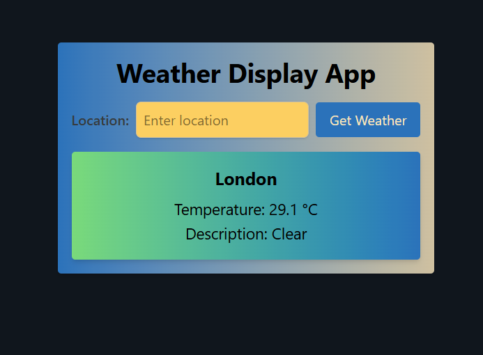
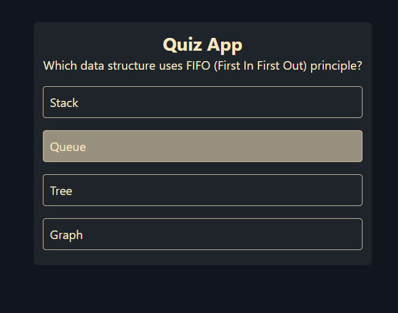
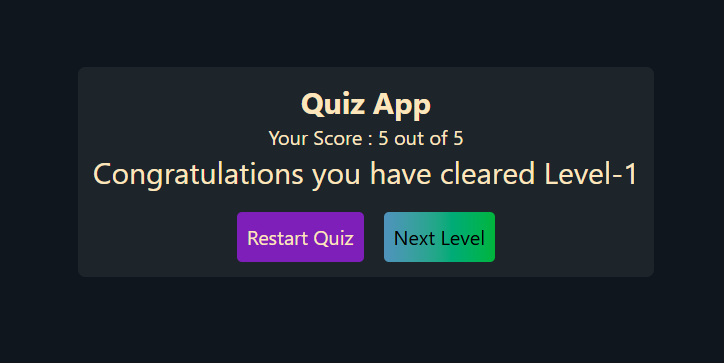
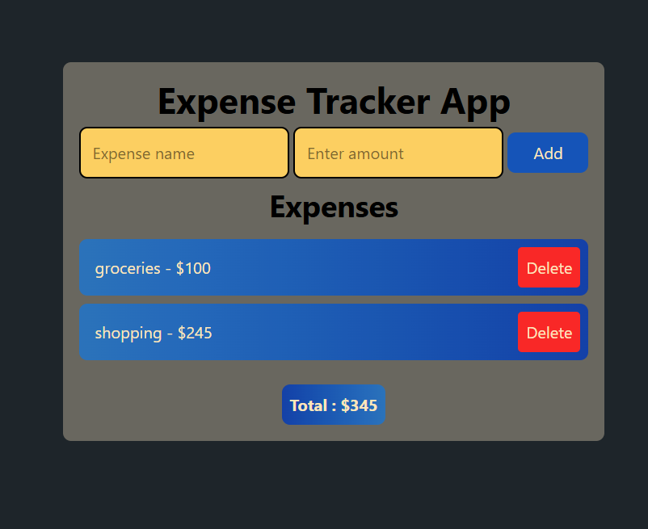

# Tailwind JS Mini Projects

A collection of mini web applications built with JavaScript and styled using Tailwind CSS. Each project is self-contained and demonstrates a different use case, from productivity tools to fun interactive apps.

## 📸 Application Previews

### 🌦️ WeatherAppProxy


### 🧠 Quiz App

!
[](./assets/quiz-3.png)

### 🛒 E-Cart App
.png)

### ✅ To-Do List
.png)

### 💰 Expense Tracker App



---

## WeatherAppProxy

A simple weather display app that fetches real-time weather data for a given location using the OpenWeatherMap API.  
**Features:**
- Enter a city name to get current temperature and weather description.
- Styled with Tailwind CSS.
- Handles API errors gracefully.

**Files:**  
- `WeatherApp/weather.html`  
- `WeatherApp/api.js`  

---

## Quiz App

A two-level quiz application with multiple-choice questions on programming and computer science topics.  
**Features:**
- Start, next, and restart quiz functionality.
- Score tracking and level progression.
- Responsive and interactive UI.

**Files:**  
- `quiz-app/index.html`  
- `quiz-app/script.js`

---

## E-Cart App

A basic e-commerce cart demo.  
**Features:**
- Add/remove products to/from cart.
- Cart persists in localStorage.
- Checkout simulation.

**Files:**  
- `e-cart-app/index.html`  
- `e-cart-app/cart.js`

---

## To-Do List

A simple to-do list manager.  
**Features:**
- Add and delete tasks.
- Tasks persist in localStorage.
- Clean, responsive UI.

**Files:**  
- `ToDoList/todo.html`  
- `ToDoList/todo.js`

---

## Expense Tracker App

Track your daily expenses.  
**Features:**
- Add expenses with name and amount.
- Delete expenses.
- Total calculation.
- Data persists in localStorage.

**Files:**  
- `expense-tracker-app/index.html`  
- `expense-tracker-app/expense.js`

---

## Setup & Usage

1. **Clone the repository:**
   ```sh
   git clone https://github.com/your-username/tailwind-js-mini-projects.git
   cd tailwind-js-mini-projects
   ```

2. **Install dependencies (if any):**
   - Most apps are static and require no build step.
   - If you want to rebuild Tailwind CSS, run:
     ```sh
     npm install
     npx tailwindcss -i ./src/input.css -o ./src/output.css --watch
     ```

3. **Open any `index.html` file in your browser to try out an app.**

4. **For WeatherAppProxy:**  
   - You may need to set your OpenWeatherMap API key in `WeatherAppProxy/api_key.js`.

---

## Credits

Created by Dipanshu Raj.  
Inspired by various web development tutorials and challenges.
